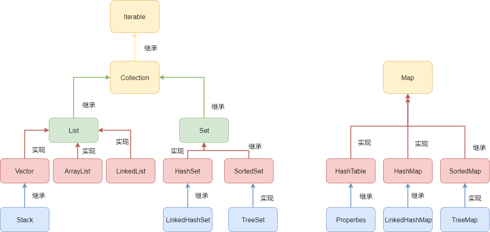

# 集合

在平常的开发中，使用集合来作为对象的容器；在计算机中主要的数据结构有数组与链表，而根据逻辑结构产生了更加多样的容器。常用的容器如下图所示：



在开发中使用较多的是ArrayList、LinkedList、HashMap等集合，涉及这部分集合的操作也是最为基础的部分。在并发包中concurrentHashMap,ConcurrentLinkedQueue等是并发场景下尝试用的集合。

### Iterable

Iterable是一个接口,Collection是继承与它的接口。其中Iterable的主要方法有：

```text
public interface Iterable<T> {
     /**
      *返回一个iterator的元素，类型为T
      */
    Iterator<T> iterator();

    /**
     * 从1.8开始，接口中存在默认实现
     */
    default void forEach(Consumer<? super T> action) {
        Objects.requireNonNull(action);
        for (T t : this) {
            action.accept(t);
        }
    }

    /**
     * 从1.8开始，接口的默认实现。创建一个spliterator，
     */
    default Spliterator<T> spliterator() {
        return Spliterators.spliteratorUnknownSize(iterator(), 0);
    }
}
```

### Collection

```text
public interface Collection<E> extends Iterable<E> {
    // 查询操作
    /**
     * 返回元素个数
     */
    int size();

    /**
     * 如果这个集合中没有元素则返回True
     */
    boolean isEmpty();

    /**
     * 如果此集合中有该元素，那么返回True
     */
    boolean contains(Object o);

    /**
     * 返回一个iterator
     */
    Iterator<E> iterator();

    /**
     * 
     */
    Object[] toArray();

    /**
     * 
     */
    <T> T[] toArray(T[] a);

    // 更新操作

    /**
     * 添加元素
     */
    boolean add(E e);

    /**
     * 移除元素
     */
    boolean remove(Object o);


    // Bulk Operations

    /**
     * 
     */
    boolean containsAll(Collection<?> c);

    /**
     * 
     */
    boolean addAll(Collection<? extends E> c);

    /**
     * 
     */
    boolean removeAll(Collection<?> c);

    /**
     * 
     */
    default boolean removeIf(Predicate<? super E> filter) {
        Objects.requireNonNull(filter);
        boolean removed = false;
        final Iterator<E> each = iterator();
        while (each.hasNext()) {
            if (filter.test(each.next())) {
                each.remove();
                removed = true;
            }
        }
        return removed;
    }

    /**
     * 
     */
    boolean retainAll(Collection<?> c);

    /**
     * 
     */
    void clear();


    // Comparison and hashing

    /**
     * 
     */
    boolean equals(Object o);

    /**
     * 
     */
    int hashCode();

    /**
     *
     */
    @Override
    default Spliterator<E> spliterator() {
        return Spliterators.spliterator(this, 0);
    }

    /**
     * 
     */
    default Stream<E> stream() {
        return StreamSupport.stream(spliterator(), false);
    }

    /**
     * 
     */
    default Stream<E> parallelStream() {
        return StreamSupport.stream(spliterator(), true);
    }
```

### ArrayList

ArrayList是一个实现了List接口的动态数组。ArrayList与Vector除了线程不同步之外，大致相同。开发中也是最经常使用它。它属性如下：

```text
   /**
     * 默认容量
     */
    private static final int DEFAULT_CAPACITY = 10;

    /**
     * 空数组常量
     */
    private static final Object[] EMPTY_ELEMENTDATA = {};

    /**
     * 默认空数组常量
     */
    private static final Object[] DEFAULTCAPACITY_EMPTY_ELEMENTDATA = {};

    /**
     * 存放元素的数组，可以看出低层是一个Object
     */
    transient Object[] elementData; // non-private to simplify nested class access

    /**
     * 数组的大小
     */
    private int size;
    
    /**
     * 允许数组申请的最大空间，在一些VMs中尝试给申请大容量给数组，会出现
     * OutOfMemoryError：Requested array size exceeds VM limit
     */
    private static final int MAX_ARRAY_SIZE = Integer.MAX_VALUE - 8;
```

它的构造方法：

```text
    /**
     * 构造方法
     */
    public ArrayList(int initialCapacity) {
        if (initialCapacity > 0) {
            this.elementData = new Object[initialCapacity];
        } else if (initialCapacity == 0) {
            //如果传入值为零，则还是按照默认的大小初始化数组
            this.elementData = EMPTY_ELEMENTDATA;
        } else {
            throw new IllegalArgumentException("Illegal Capacity: "+
                                               initialCapacity);
        }
    }

    /**
     * 构造方法：空数组，默认为10
     */
    public ArrayList() {
        this.elementData = DEFAULTCAPACITY_EMPTY_ELEMENTDATA;
    }

    /**
     * 从特殊的集合中构造一个List
     */
    public ArrayList(Collection<? extends E> c) {
        elementData = c.toArray();
        if ((size = elementData.length) != 0) {
            // c.toArray might (incorrectly) not return Object[] (see 6260652)
            if (elementData.getClass() != Object[].class)
                elementData = Arrays.copyOf(elementData, size, Object[].class);
        } else {
            // replace with empty array.
            this.elementData = EMPTY_ELEMENTDATA;
        }
    }
```

总的来说，ArrayList是一个动态数组，它在创建时的大小为0，当初次初始化时，大小为默认为10；每次扩容都是当前数组的1.5倍。与之相似的Vector，基本上的方式实现都是相似的，只是在线程同步上面做了调整，使用synchronized来保证线程安全，另外一个区别就i是多了一个CapacityIncrement属性。ArrayList与Vector的add、get、size在算法复杂度上都是O\(1\)的，remove方法是O\(n\)的。

