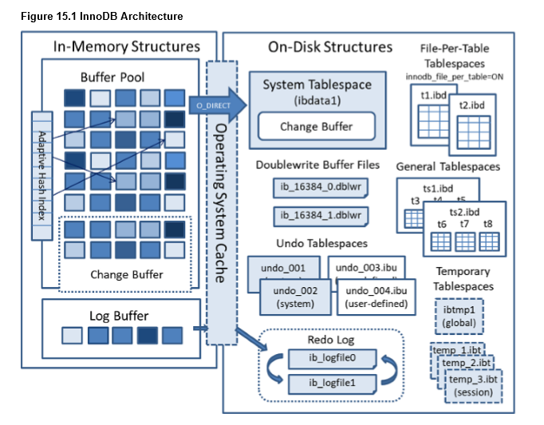

# MySQL-InnoDB引擎

MySQL是目前关系型数据库中比较重要的一个角色，应用也最为广泛。主要的篇幅是为了介绍InnoDB数据库引擎，这也是从MySQL8开发，默认使用的数据库引擎，它有着许多的亮点，一步步揭开它神秘的面纱。

### InnoDB的后台线程

#### Master Thread:

主要负责将缓冲池中的数据异步刷新到磁盘中，保证数据的一致性，包括脏页的刷新、合并插入缓冲、undo页的回收等。

#### IO Thread

InnoDB中大多都采用async IO来处理请求。

1. read
2. write
3. insert buffer
4. log thread

#### Purge Thread

用来回收事务执行后的undolog。

#### Page Cleaner Thread

将脏页的刷新操作单独的线程中来完成，减少Master Thread的压力。

### InnoDB的内存

图

缓冲池为了减小磁盘与CPU之间的鸿沟，通过缓冲池来提高性能。缓冲池是使用LRU来进行管理的，但是与我们平常所说的LRU有稍微的不同，其中它多了影响因素：innodb\_old\_blocks\_pct\(midpoint\)与innodb\_old\_blocks\_time。midpoint大约是在整个缓冲的5/8处，这样做的原因是：尽量避免非热点数据占据LRU的头部，当进行读取的时候，可能会出现当前读取的页数较多，导致处于热点的页被刷新到LRU尾部，或者过于多的页导致热点数据被刷出LRU缓存，所以需要一个midpoint的位置，当读取到新的页时，先放在midpoint的位置。innodb\_old\_blocks\_time用于表示读取到mid位置后需要待多久才会被加入到LRU列表的热端。

buffer pool hit rate表示缓冲命中率，如果命中率低于95%时，观察是否LRU列表被污染。

### InnoDB的checkpoint技术

checkpoint解决的问题有缩短数据库的恢复时间，缓冲池不够用时，将脏页数据刷新到磁盘中，重做日志不可用时，刷新脏页。

#### checkpoint的类型：

Fuzzy checkpoint

Sharp checkpoint

### InnoDB关键特性

插入缓冲

两次写

自适应哈希索引

异步IO

刷新临近页

### InnoDB中的锁类型

共享锁（S Lock）

排他锁（X Lock）

